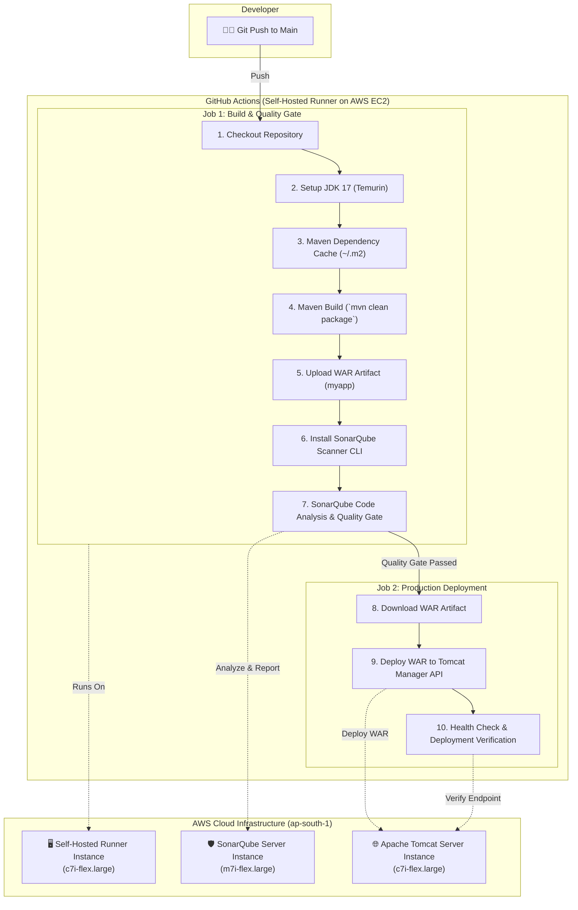

# 🚀 Disney+ Hotstar Clone — End-to-End DevOps CI/CD Pipeline

[](https://github.com/devkunaljadhav/github-actions-project/actions)
[](https://adoptium.net/)
[](https://maven.apache.org/)
[](https://www.sonarqube.org/)
[](https://tomcat.apache.org/)
[](https://aws.amazon.com/ec2/)
[](LICENSE)

An enterprise-grade **DevOps Continuous Integration & Continuous Deployment (CI/CD) Pipeline** implementing automated build, dependency caching, static code analysis with SonarQube, artifact archiving, and zero-downtime automated deployment of a **Disney+ Hotstar web application** to **Apache Tomcat** running on **AWS EC2** infrastructure.

---

## 📸 Application & Pipeline Previews

### 🎬 Disney+ Hotstar Web Application


### ⚙️ GitHub Actions CI/CD Pipeline Execution


### 🛡️ SonarQube Static Code Analysis & Quality Gate


### ☁️ AWS EC2 Cloud Infrastructure


---

## 🏗️ Architecture & Pipeline Flow



---

## 🌟 Key Features

- **Automated CI/CD Workflows**: Multi-stage GitHub Actions pipeline triggered automatically on git push to the `main` branch or manual dispatch.
- **Fast Builds with Dependency Caching**: Utilizes `actions/cache` for `~/.m2/repository` to accelerate build times significantly.
- **Static Code Analysis & Security**: Integrated with SonarQube Scanner CLI to scan for bugs, security hotspots, code smells, and enforce quality gate standards.
- **Artifact Versioning**: Stores and tracks built `.war` artifacts via GitHub Actions Artifact Store (`actions/upload-artifact` & `actions/download-artifact`).
- **Automated Tomcat Deployment**: Programmatic zero-touch deployment to Apache Tomcat using the Tomcat Manager HTTP API with secure credentials.
- **Automated Smoke / Health Verification**: Post-deployment HTTP status validation to guarantee application uptime.
- **AWS Cloud Infrastructure**: Provisioned on dedicated AWS EC2 instances running Amazon Linux / Enterprise Linux.

---

## 📂 Project Structure

```text
github-actions-project/
├── .github/
│   └── workflows/
│       └── maven.yml               # GitHub Actions CI/CD Pipeline definition
├── screenshots/
│   ├── app-preview.png             # Hotstar web app screenshot
│   ├── aws-ec2-infrastructure.png  # AWS EC2 instances screenshot
│   ├── github-actions-pipeline.png # CI/CD execution screenshot
│   └── sonarqube-quality-gate.png  # SonarQube analysis results screenshot
├── src/
│   ├── main/
│   │   ├── java/
│   │   │   └── in/javahome/myweb/controller/
│   │   │       └── Calculator.java # Application Controller
│   │   └── webapp/
│   │       ├── assets/             # Images, Videos, Scripts
│   │       │   ├── images/
│   │       │   ├── js/
│   │       │   └── video/
│   │       ├── WEB-INF/
│   │       │   └── web.xml         # Servlet & Deployment descriptor
│   │       ├── index.jsp           # Main Landing UI Page
│   │       └── style.css           # Styling
│   └── test/
│       └── java/
│           └── in/javahome/myweb/controller/
│               └── CalculatorTest.java # Unit tests
├── .gitignore                      # Git ignore rules for Java/Maven/IDEs
├── LICENSE                         # MIT License
├── pom.xml                         # Maven Project Object Model
└── README.md                       # Project Documentation
```

---

## 🔐 GitHub Secrets Configuration

To run this pipeline, configure the following **Secrets** under your GitHub repository (`Settings > Secrets and variables > Actions`):

| Secret Key | Description | Example / Target |
| :--- | :--- | :--- |
| `SONAR_HOST` | URL of the SonarQube server | `http://<SONARQUBE_EC2_IP>:9000` |
| `SONAR_TOKEN` | Authentication token generated in SonarQube | `sqa_xxxxxxxxxxxxxxxxxxxxxxxx` |
| `TOMCAT_HOST` | Host and port of the Apache Tomcat server | `<TOMCAT_EC2_IP>:8080` |
| `TOMCAT_USER` | Tomcat Manager username (configured in `tomcat-users.xml`) | `admin` / `tomcat` |
| `TOMCAT_PASSWORD`| Tomcat Manager password | `YourStrongPassword` |

---

## 🛠️ Local Development & Build

### Prerequisites
- **Java Development Kit (JDK)**: Version 17+ or 8+
- **Apache Maven**: Version 3.8+
- **Apache Tomcat**: Version 9 or 10

### Build WAR Package
```bash
# Clone the repository
git clone https://github.com/devkunaljadhav/github-actions-project.git

# Navigate to project directory
cd github-actions-project

# Compile and package application
mvn clean package

# The generated artifact will be located at:
# target/myapp.war
```

### Run Unit Tests
```bash
mvn test
```

---

## 🤝 Contributing

Contributions, issues, and feature requests are welcome!
Feel free to check the [issues page](https://github.com/devkunaljadhav/github-actions-project/issues).

---

## 📄 License

This project is licensed under the [MIT License](LICENSE).