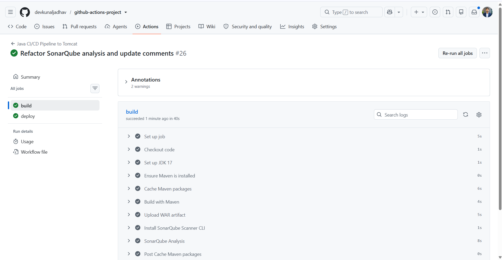
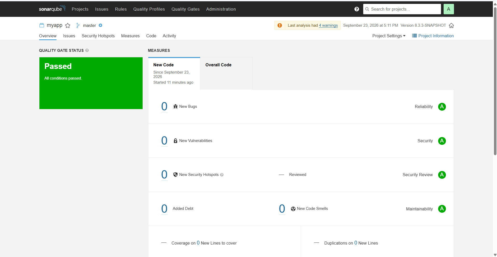
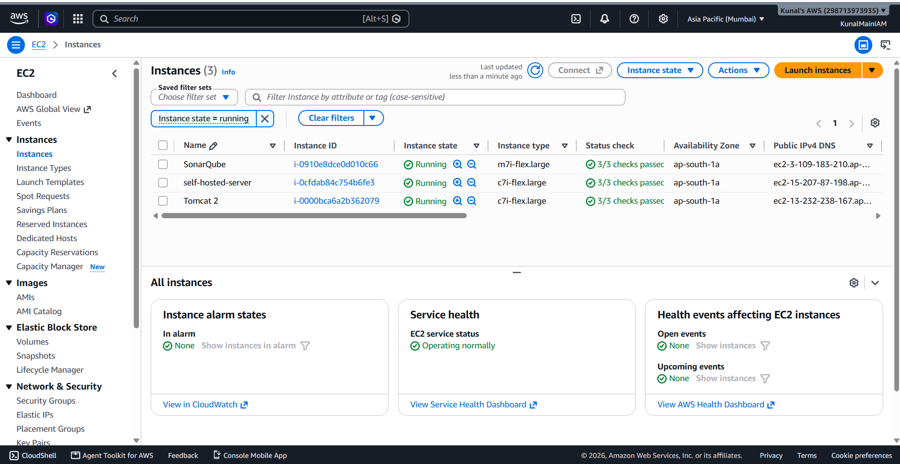
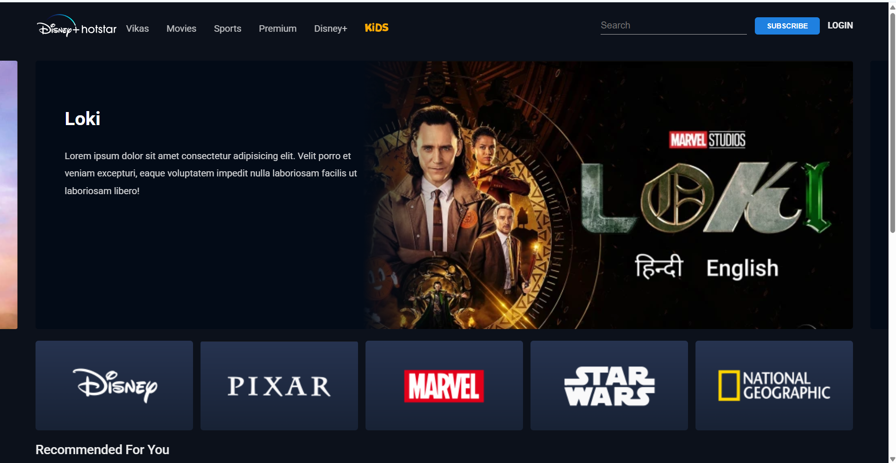
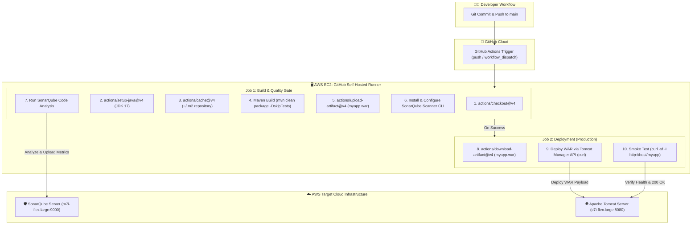

<div align="center">

# ⚡ Enterprise Java CI/CD Pipeline with GitHub Actions
### Automated Build, Code Quality Gate, Artifact Archival & Zero-Downtime AWS Tomcat Deployment

[](https://github.com/devkunaljadhav/github-actions-project/actions)
[](https://aws.amazon.com/ec2/)
[](https://adoptium.net/)
[](https://maven.apache.org/)
[](https://www.sonarqube.org/)
[](https://tomcat.apache.org/)
[](LICENSE)

<p align="center">
  A production-ready DevOps implementation demonstrating a robust <b>Continuous Integration & Continuous Deployment (CI/CD)</b> pipeline using <b>GitHub Actions Self-Hosted Runners</b> on <b>AWS Cloud</b>.
</p>

---

</div>

## 📌 Project Overview

This project showcases a complete DevOps workflow automating the lifecycle of a Java Web Application (Disney+ Hotstar UI clone) from code commit to cloud deployment:

- **Source Code Management**: GitHub repository with branch protection and automated triggers.
- **CI/CD Automation Engine**: GitHub Actions utilizing self-hosted Linux runners on AWS EC2.
- **Dependency Optimization**: High-speed builds leveraging Maven repository caching.
- **Static Code Analysis & Security**: Automated SonarQube Scanner integration enforcing quality gates.
- **Artifact Management**: Immutable `.war` builds archived via GitHub Actions Artifact Store.
- **Automated Continuous Deployment**: Programmatic release to Apache Tomcat via Tomcat Manager API.
- **Automated Smoke Testing**: Post-deployment HTTP verification ensuring service uptime.

---

## 📸 Pipeline & Deployment Proofs

<div align="center">
  <table>
    <tr>
      <td width="50%">
        <h4 align="center">1. GitHub Actions Pipeline Execution</h4>
        
        <p align="center"><i>All build and quality gate stages passed cleanly on the self-hosted runner.</i></p>
      </td>
      <td width="50%">
        <h4 align="center">2. SonarQube Quality Gate Status</h4>
        
        <p align="center"><i>Zero bugs, vulnerabilities, security hotspots, and zero code smells (Grade A).</i></p>
      </td>
    </tr>
    <tr>
      <td width="50%">
        <h4 align="center">3. AWS EC2 Cloud Infrastructure</h4>
        
        <p align="center"><i>Dedicated EC2 instances for Runner, SonarQube Server, and Apache Tomcat.</i></p>
      </td>
      <td width="50%">
        <h4 align="center">4. Live Application Deployed on Tomcat</h4>
        
        <p align="center"><i>Disney+ Hotstar web application live and accessible over port 8080.</i></p>
      </td>
    </tr>
  </table>
</div>

---

## 🏗️ Architecture & CI/CD Pipeline Workflow



---

## 🔍 Deep-Dive: Pipeline Stages & Implementation

The entire pipeline is defined in [`.github/workflows/maven.yml`](.github/workflows/maven.yml):

### 1️⃣ Job: `build` (Continuous Integration)
1. **Repository Checkout (`actions/checkout@v4`)**: Fetches repository code on the runner.
2. **JDK Setup (`actions/setup-java@v4`)**: Configures Eclipse Temurin OpenJDK 17 environment.
3. **Maven Dependency Caching (`actions/cache@v4`)**: Caches `~/.m2/repository` keyed by `pom.xml` hash, reducing build times from minutes to seconds.
4. **Compile & Package**: Executes `mvn clean package -DskipTests` to produce the deployable `target/myapp.war`.
5. **Artifact Upload (`actions/upload-artifact@v4`)**: Archives the generated WAR artifact for cross-job sharing.
6. **SonarScanner CLI Setup**: Dynamically provisions SonarQube Scanner CLI `7.3.0` and exports it to `$GITHUB_PATH`.
7. **Static Code Analysis**: Scans project source files (`src/`) and compiled bytecodes (`target/classes`), sending telemetry to the dedicated SonarQube instance.

### 2️⃣ Job: `deploy` (Continuous Deployment)
1. **Artifact Retrieval (`actions/download-artifact@v4`)**: Downloads the verified `myapp.war` build artifact.
2. **Automated Tomcat Deployment**: Pushes the WAR directly to Tomcat using the Tomcat Manager REST API:
   ```bash
   curl -v --fail --upload-file "$WAR_FILE" \
     -u "${TOMCAT_USER}:${TOMCAT_PASSWORD}" \
     "http://${TOMCAT_HOST}/manager/text/deploy?path=/myapp&update=true"
   ```
3. **Automated Verification & Smoke Test**: Performs an HTTP status check against the deployment endpoint:
   ```bash
   curl -sf -I "http://${TOMCAT_HOST}/myapp"
   ```

---

## ☁️ AWS Cloud Infrastructure Setup

The infrastructure was provisioned in **AWS Region `ap-south-1` (Mumbai)** across 3 dedicated EC2 instances:

| Node Name | Instance Type | OS | Role / Services |
| :--- | :--- | :--- | :--- |
| **`self-hosted-server`** | `c7i-flex.large` | Amazon Linux 2023 | GitHub Actions Runner, JDK 17, Maven, Sonar-Scanner |
| **`SonarQube`** | `m7i-flex.large` | Amazon Linux 2023 | SonarQube Server (Port `9000`), PostgreSQL |
| **`Tomcat 2`** | `c7i-flex.large` | Amazon Linux 2023 | Apache Tomcat Web Server (Port `8080`), Java 17 |

---

## 🔐 GitHub Secrets Configuration

To configure this pipeline in your own repository, navigate to **Settings > Secrets and variables > Actions** and add the following repository secrets:

| Secret Name | Description | Example / Format |
| :--- | :--- | :--- |
| `SONAR_HOST` | Full HTTP URL to SonarQube Server | `http://13.232.xxx.xxx:9000` |
| `SONAR_TOKEN` | User authentication token generated in SonarQube | `sqa_xxxxxxxxxxxxxxxxxxxxxxxx` |
| `TOMCAT_HOST` | IP/DNS and port of Apache Tomcat instance | `13.232.xxx.xxx:8080` |
| `TOMCAT_USER` | Tomcat Manager username (configured with `manager-script` role) | `admin` |
| `TOMCAT_PASSWORD` | Password for the Tomcat Manager user | `********` |

---

## 📁 Repository Structure

```text
├── .github/
│   └── workflows/
│       └── maven.yml               # GitHub Actions CI/CD Pipeline
├── screenshots/                    # Documentation & Proof Images
│   ├── app-preview.png
│   ├── aws-ec2-infrastructure.png
│   ├── github-actions-pipeline.png
│   └── sonarqube-quality-gate.png
├── src/
│   ├── main/
│   │   ├── java/                   # Java Source code & Controllers
│   │   └── webapp/                 # JSP, HTML5, CSS3, JS & UI Media Assets
│   └── test/                       # Unit & Integration Tests (JUnit)
├── .gitignore                      # Git ignore patterns for Java/Maven/IDEs
├── LICENSE                         # MIT License
├── pom.xml                         # Maven build configuration & dependencies
└── README.md                       # Complete DevOps Project Documentation
```

---

## 💻 Local Build & Run

### Prerequisites
- Java 17 or higher
- Apache Maven 3.8+

```bash
# 1. Clone repository
git clone https://github.com/devkunaljadhav/github-actions-project.git
cd github-actions-project

# 2. Compile and package application
mvn clean package

# 3. Output artifact location
ls -lh target/myapp.war
```

---

## 👨‍💻 Author

**Kunal Jadhav**
- GitHub: [@devkunaljadhav](https://github.com/devkunaljadhav)

---

## 📄 License

This project is licensed under the [MIT License](LICENSE).